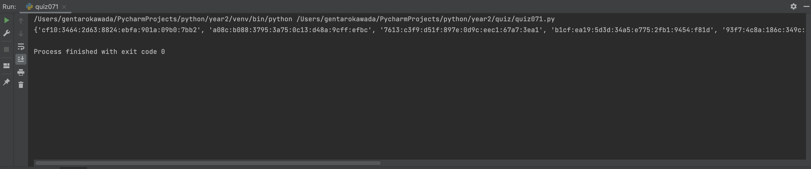

# quiz071
## Prompt
Create the code for the IPv6 machine

## Code Structure
### Python Flie
```.py
import random


class ipv6machine:
    def __init__(self, number):
        self.number_wanted = int(number)

    def create_ipv6_address(self):
        hex = "0123456789abcdef"
        output = set()
        while len(output) < self.number_wanted:
            big_temp = ""
            for i in range(8):
                temp = ""
                for j in range(4):
                    temp = temp + hex[random.randint(0, 15)]
                big_temp = big_temp + temp + ":"
            output.add(big_temp[:-1])
            # print(big_temp[:-1])
        return output

    def create_ipv6_address_v2(self):
        hex_chars = "0123456789abcdef"

        def generate_address():
            return ":".join(''.join(random.choice(hex_chars) for _ in range(4)) for _ in range(8))

        output = set()
        while len(output) < self.number_wanted:
            output.add(generate_address())

        return output

    def dec2hex(self, digit):
        hex_dig = "abcdef"
        if digit < 16:
            if digit < 10:
                return str(digit)
            else:
                return hex_dig[digit - 10]
        return None

    def get_rand_hex(self):
        return self.dec2hex(random.randint(0, 15))

    def sixtect_hex(self):
        group = ""
        for _ in range(4):
            group += self.get_rand_hex()
        return group

    def create_ipv6_address_v3(self):
        output = set()
        while len(output) < self.number_wanted:
            address = ""
            for _ in range(8):
                address += self.sixtect_hex()
                if _ != 7:
                    address += ":"
            output.add(address)
        return output


test1 = ipv6machine(10)
print(test1.create_ipv6_address_v2())
```

## Paper Programming


## Evidence

