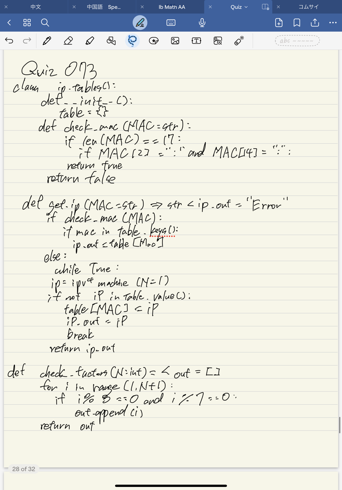
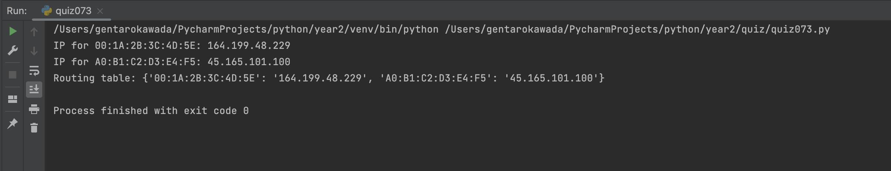

# quiz073
## Prompt
Create a simple program to manage a network routing table. A routing table is used by network devices, like routers, to determine where to send data based on MAC addresses. Your program will help manage the mapping between MAC and IP addresses.
## Code Structure

### Python File
```.py
class ip_tables():
    def __init__(self):
        self.routing_table = {}

    def check_mac(self, MAC:str)->bool:
        return len(MAC) == 17 and MAC.count(":") == 5

    def ipv4machine(self, N:int)->str:
        import random
        output = set()
        while len(output) < N:
            temp = ""
            for i in range(4):
                temp += str(random.randint(0, 255))
                if i != 3:
                    temp += "."
            output.add(temp)
        return output.pop()

    def get_ip(self, MAC:str)->str:
        ip_out = "Error"
        if self.check_mac(MAC):
            if MAC in self.routing_table.keys():
                ip_out = self.routing_table[MAC]
            else:
                while True:
                    ip = self.ipv4machine(N=1)
                    if not ip in self.routing_table.values():
                        self.routing_table[MAC].append(ip[0])
                        ip_out = ip
                        break
            return ip_out
```

## Paper Programming

## Evidence



