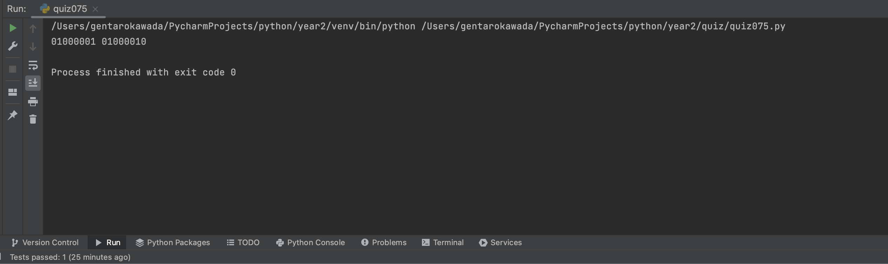
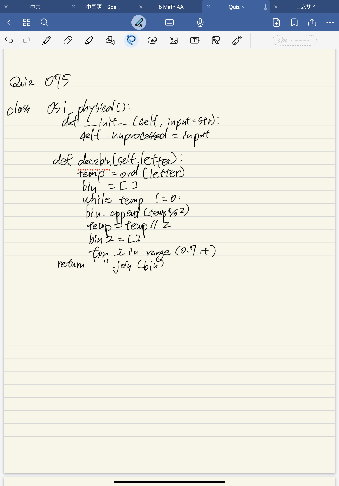

# Quiz 075

## Prompt
Physical Layer of the OSI model primarily deals with the physical aspects of data transmission, including the hardware, transmission medium (cable, waves, etc), encoding, signaling, and synchronization necessary to send raw bits between devices.

## Code Structure

### Python File
```python
class osi_phsyical():
    def __init__(self, input:str):
        self.unprocessed = input

    def dec2bin(self,letter):
        temp = ord(letter)
        bin = ""
        while temp != 0:
            bin = f"{temp % 2}" + bin
            temp= temp // 2
        if len(bin) != 8:
            bin = "0"*(8-len(bin))+bin

        return bin

    def get_output(self):
        out_str =  ""
        for letter in self.unprocessed:
            out_str += self.dec2bin(letter) + " "
        return out_str[:-1]
```

### Paper Programming


### Evidence

