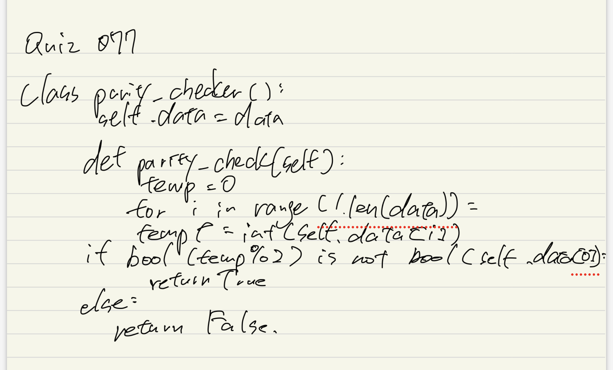
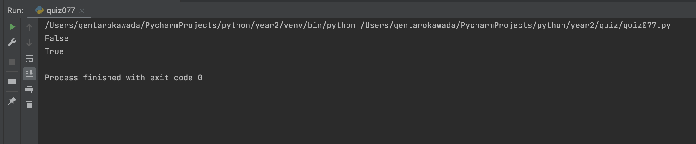

# Quiz 077

## Prompt
Physical layer is also in charge of detecting and trying to correct errors in the data transmitted. One simple way would be to send copies of the data and check that the copies match. Assume the data is 2 copies of the data plus original.
## Code Structure

### Python File
```python
class parity_checker():
    def __init__(self,data:str):
        self.data = data

    def check_parity(self):
        temp = 0
        for i in range(1,len(self.data)):
            temp += int(self.data[i])
        if bool(temp%2)  is not bool(int(self.data[0])):
            return True
        else:
            return False


boi = parity_checker("100111001011001110010110011100101")
boi2 = parity_checker("011101111101110111110111001111")

print(boi.check_parity())
print(boi2.check_parity())
```

### Paper Programming


### Evidence

